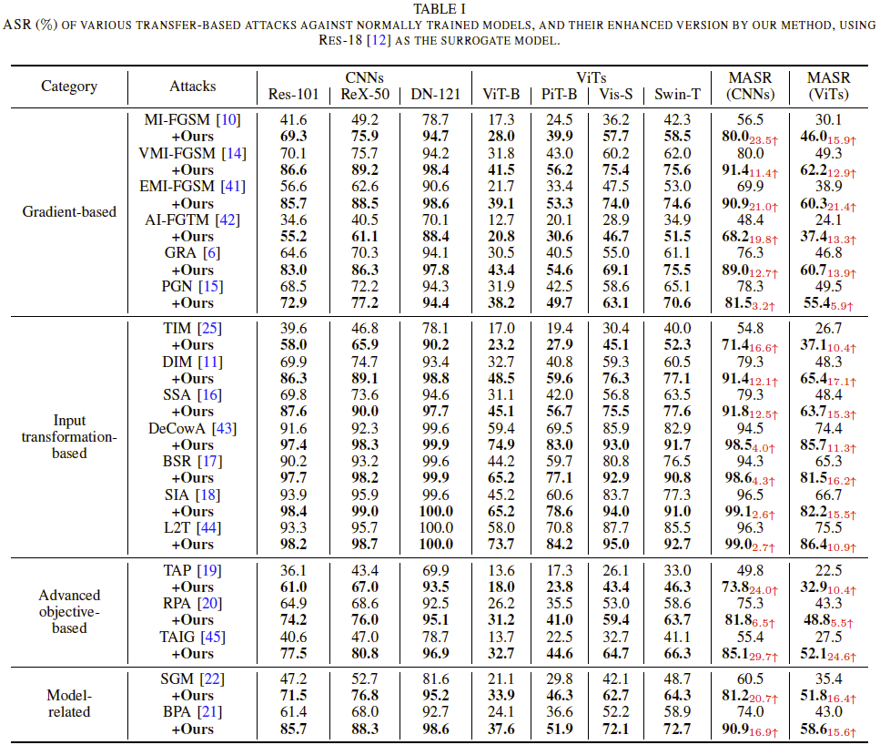

# MAP
Boosting Adversarial Transferability of Black-Box Attack

By Kaige Li, Maoxian Wan, Qichuan Geng, Xiaochun Cao, Senior Member, IEEE, and Zhong Zhou. 

The paper is under review. The full code will be released after review.


## Requirements
+ Python >= 3.6
+ PyTorch >= 1.12.1
+ Torchvision >= 0.13.1
+ timm >= 0.6.12

```bash
pip install -r requirements.txt
```


## Usage
We randomly sample 1,000 images from ImageNet validate set, in which each image is from one category and can be correctly classified by the adopted models (For some categories, we cannot choose one image that is correctly classified by all the models. In this case, we select the image that receives accurate classifications from the majority of models.). Download the data from [
](https://drive.google.com/file/d/1d-_PKYi3MBDPtJV4rfMCCtmsE0oWX7ZB/view?usp=sharing) or [](https://huggingface.co/datasets/Trustworthy-AI-Group/TransferAttack/blob/main/data.zip) into `/path/to/data`. Then you can execute the attack as follows:

```
python main.py --input_dir ./path/to/data --output_dir adv_data/mifgsm/resnet18 --attack mifgsm --model=resnet18 --mask=True
python main.py --input_dir ./path/to/data --output_dir adv_data/mifgsm/resnet18 --eval
```

## Overview

Pending!

## Method Comparison

|              |                                                                                                                               PAR (Patch-wise Adversarial Removal)                                                                                                                               |                                                                                                                                       MAP (Masked Adversarial Perturbation)                                                                                                                                      |                                                                                        CISA (Customized Iteration and Sampling Attack)                                                                                        |
|:------------:|:------------------------------------------------------------------------------------------------------------------------------------------------------------------------------------------------------------------------------------------------------------------------------------------------:|:----------------------------------------------------------------------------------------------------------------------------------------------------------------------------------------------------------------------------------------------------------------------------------------------------------------:|:-----------------------------------------------------------------------------------------------------------------------------------------------------------------------------------------------------------------------------:|
|   Objective  | Enhance query efficiency and noise compression in black-box attacks by removing noise from regions with low sensitivity.                                                                                                                                                                         | Improve adversarial sample diversity and transferability across architectures (CNNs & ViTs) by randomly masking perturbations.                                                                                                                                                                                   | Optimize query efficiency in black-box attacks by combining adaptive iteration and customized sampling for better noise compression.                                                                                          |
|   Core Idea  | - Partition the adversarial example into multiple patches and evaluate their noise sensitivity.  - Prioritize the removal of noise from low-sensitivity regions to reduce redundant perturbations.  - Employ a coarse-to-fine strategy to refine noise compression and enhance query efficiency. | - Randomly mask perturbation regions during adversarial sample generation to improve attack diversity.  - Utilize Soft Mask Generation (SMG) to ensure smooth masking and reduce statistical shifts.  - Employ Curriculum Mask Learning (CML) to gradually increase the masking ratio, enhancing generalization. | - Combine transfer-based and decision-based attack strategies.  - Optimize step size estimation via Gaussian Stepsize Adjustment.  - Implement Customized Sampling to refine perturbation search and avoid redundant queries. |
| Key Features | - Focuses on query efficiency by eliminating unnecessary computations and improving noise compression.  - Designed for decision-based black-box attacks, reducing the required number of queries.                                                                                                | - Focuses on attack transferability, improving adversarial effectiveness across different models.  - Designed for gradient-based black-box attacks, enhancing perturbation diversity and robustness.                                                                                                             | - Focuses on query efficiency and adaptive search, combining different attack strategies to improve overall performance.  - Uses dual-direction iteration to avoid local optima and enhance attack success rates.             |

## Experimental Results

<p align="center">
  </br>
  <span align="center">ASR ($\%$) of various transfer-based attacks against normally trained models, and their enhanced version by our method, using Res-18 as the surrogate model. </span> 
</p>
Our MAP achieves noticeable performance improvements on various black-box attack methods.


## TODO
- [ ] Upload the updated code
- [ ] Reorganize the code repository

## Acknowledgements

This project is based on the following open-source projects. We thank their
authors for making the source code publically available.

* [SIA](https://github.com/xiaosen-wang/SIT)
* [TransferAttack](https://github.com/Trustworthy-AI-Group/TransferAttack)
